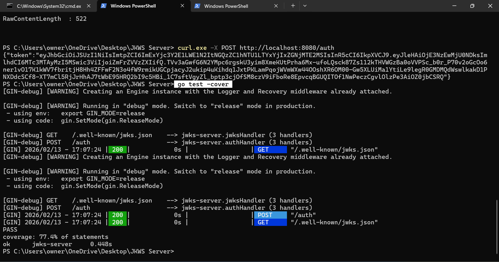

# JWKS Server (FastAPI)

A simple JSON Web Key Set (JWKS) server built with FastAPI.

This project:
- Generates RSA key pairs
- Serves public keys via a JWKS endpoint
- Issues signed JWTs
- Supports expired key testing
- Includes automated tests with coverage

---

## 🚀 Features

- 🔐 RSA key generation
- 🔁 Automatic key rotation (background thread)
- 📦 JWKS endpoint (`/jwks.json`)
- 🪪 JWT issuing endpoint (`/auth`)
- 🧪 Pytest test suite
- 📊 Code coverage reporting

---

## 🛠 Installation

1. Clone or download the project.

```bash
python -m venv venv
venv\Scripts\activate

---
Install dependencies:
'''bash
pip install fastapi uvicorn cryptography pyjwt pytest pytest-cov

----

## Running the Server

'''bash
python -m uvicorn main:app --reload --port 8080

Server will run at:

http://127.0.0.1:8080

---
Endpoints
GET /jwks.json

Returns active public keys in JWKS format.

'''bash
curl http://127.0.0.1:8080/jwks.json
 include screenshot
---
POST /auth

Generates a signed JWT.
screenshot

POST /auth?expired=true
Generates a JWT signed with an expired key (for testing purposes)

🧪 Running Tests

Run tests:

python -m pytest

python -m pytest --cov=.  // Run tests with coverage
python -m pytest --cov=. --cov-report=html  // Generate HTML coverage report:

screenshot

HTML report will be generated in:

htmlcov/index.html

##📊 Coverage
Current coverage: ~86%

## ⚙️ Technologies Used

FastAPI

Uvicorn

PyJWT

Cryptography

Pytest

Pytest-Cov

📌 Notes

Expired keys are intentionally supported for testing.

Active keys are returned in the JWKS endpoint.

The project uses in-memory key storage.


------

# JWKS Server Project

## Description
This project implements a **JWKS (JSON Web Key Set) server** that:

- Generates RSA key pairs with unique `kid`s and expiry timestamps
- Provides a **JWKS endpoint** (`/.well-known/jwks.json`) serving only unexpired public keys
- Implements an **/auth endpoint** that issues signed JWTs
  - Supports issuing expired JWTs via the `?expired=true` query parameter
- Demonstrates key expiry and proper `kid` usage in JWTs


## Requirements
- Go (1.21+ recommended)
- Gin Web Framework
- Windows, macOS, or Linux terminal (PowerShell or bash)

## Screenshots
### 1. JWKS Endpoint
This screenshot shows the JSON Web Key Set (JWKS) returned by the server at the endpoint:

- Only **unexpired keys** are included.  
- Each key has a **unique `kid`** that clients use to verify JWTs.  
- The JSON output includes key parameters like `kty` (key type), `alg` (algorithm), `n` (modulus), and `e` (exponent).  


### 2. Auth Endpoint
This screenshot shows the JWT returned by the `/auth` endpoint:

- Demonstrates that the server can issue a signed JWT.  
- The JWT includes a **header with `kid`**, so the client knows which key from the JWKS to use for verification.  
- Using the `?expired=true` query parameter issues a JWT signed with an **expired key**, useful for testing key rotation behavior.  


### 3. Test Coverage
This screenshot shows the results of running:
- Confirms that **all tests pass**.  
- Shows **coverage percentage** of your Go code (e.g., 77.4%).  
- Ensures that your server functions correctly and all endpoints behave as expected.  



## Installation / Setup

1. Clone the repository:

```bash
https://github.com/mairesse24/JWKS-Server/blob/main/README.md
cd jwks-server


